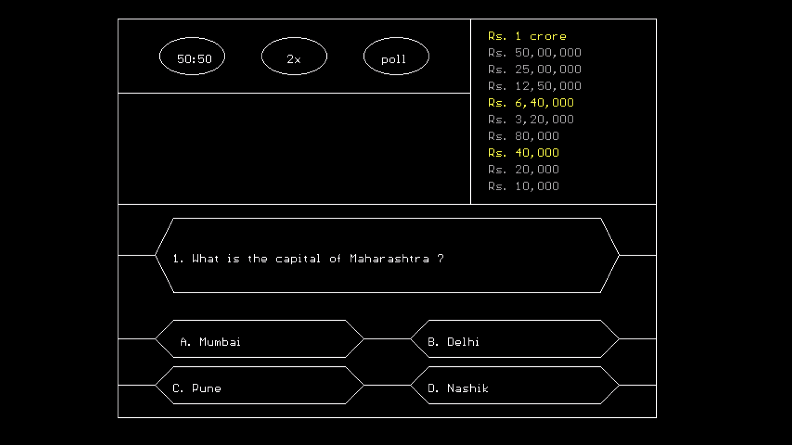
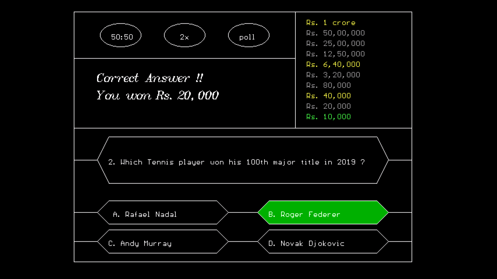
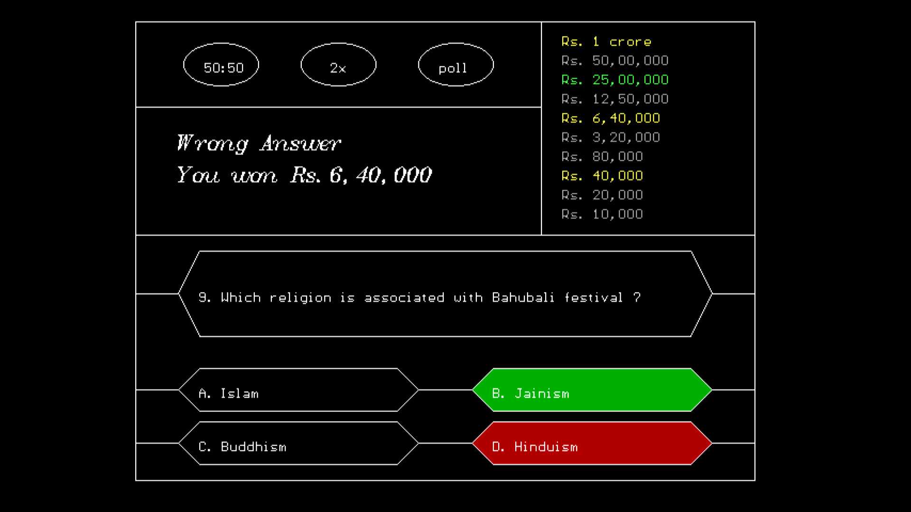
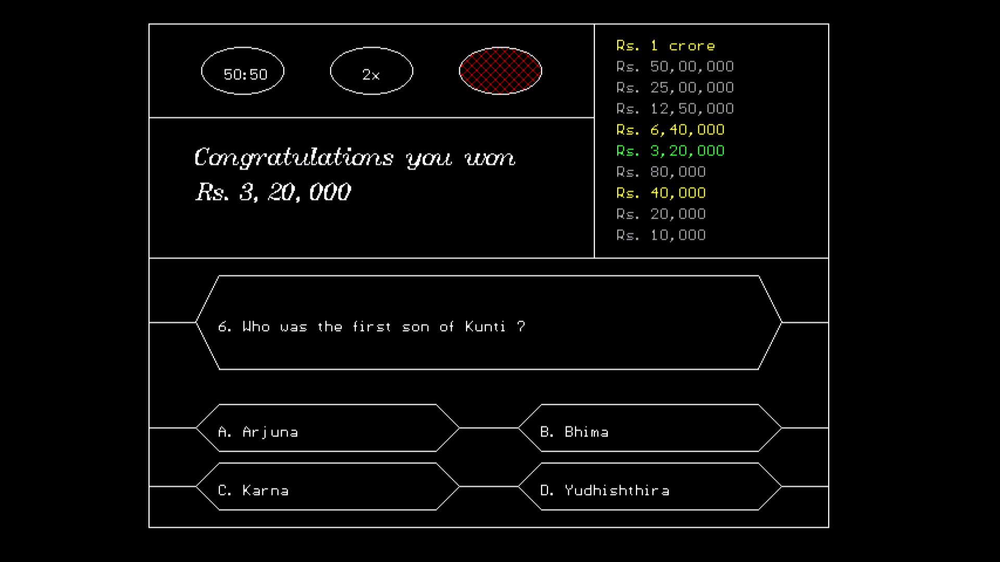
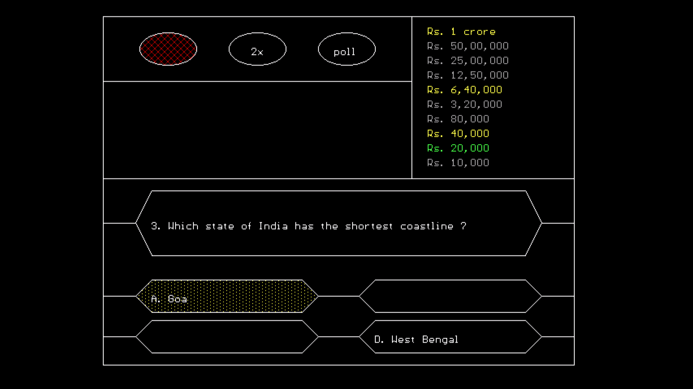
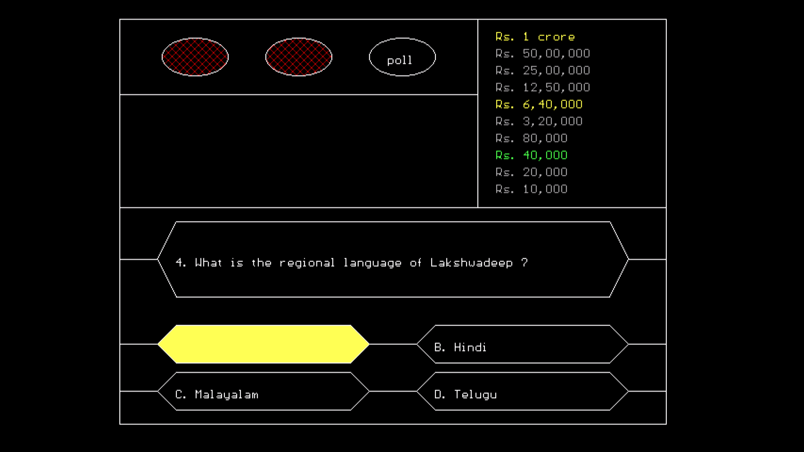
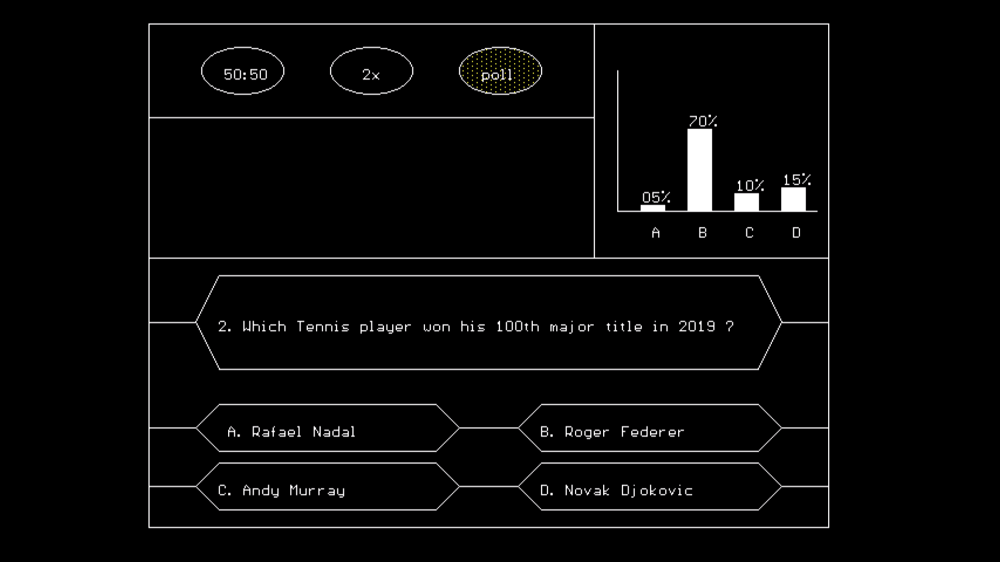

# QuizContest

College Mini Project for Computer Graphics

### Description
A multiple choice based quiz contest game. Player can answer a maximum of 10 questions. Player has to go up the money ladder with the difficulty of questions increasing with each correct answer. If the player gives a wrong answer, he/she will get the amount associated with the last checkpoint. Players also have the option of quitting the game by taking home the money they have won. Players can make use of 3 lifelines, namely 50:50, double dip and audience poll, at any stage of the game. These lifelines can be used only once. 50:50 deletes 2 wrong options of the given 4 options, double dip allows the players to select 2 answers and audience poll give a graphical display of the number of people backing a particular option (it depends on the player whether to go with or against the audience poll).

---

### Team Members
* Hrishikesh Shennai
* Jay Gala
* Kaustubh Kekre

---

### Sample Shots

__Layout__

__Correct Answer__

__Wrong Answer__

__Quitting Voluntarily__

__Lifelines - 50:50__

__Lifelines - Double Dip__

__Lifelines - Audience Poll__

---

### Open Source Contribution

If anyone of you think to improve this project, we are open to changes and send the pr it will help someone else as an idea for mini projects

